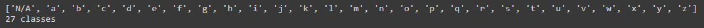
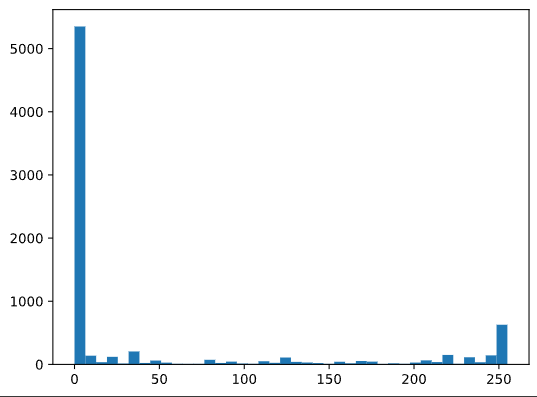
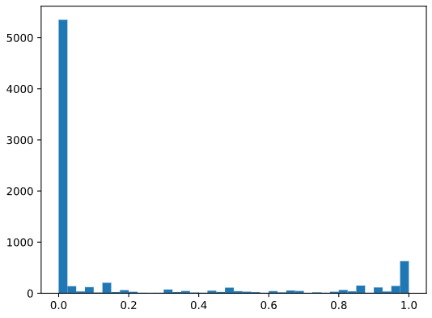
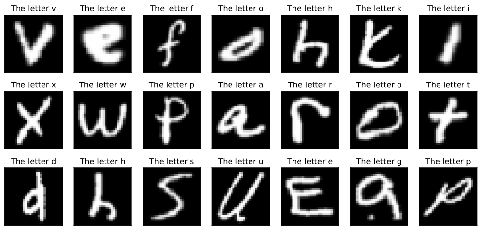
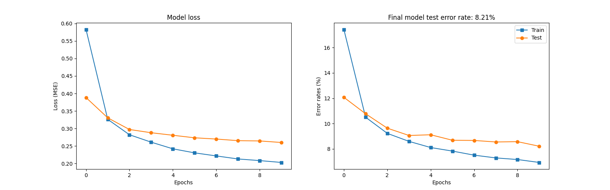

# About

Handwritten character recognition from letters "a" to "z" using mnist dataset using the pytorch library. The program uses a Convolutional Neural Network to classify images of handwritten characters.

## Preparing the dataset

```python
cdata = torchvision.datasets.EMNIST(
    root="emnist", split="letters", download=True)
char_classes = cdata.classes[1:]
char_labels = cdata.targets - 1
```



<h4>The code downloads the datasets from emnist database, it also removes the 'N/A' category because it does not belong as a category for digits</h4>

## Data normalization

```python
char_images /= torch.max(char_images)
```

<h4>The data is then normalized to convert values from 0-255 to 0.0-1.0</h4>

### Before normalization



### After normalization



## Sample dataset



## Defining the model

```python
def __init__(self, printtoggle):
    super().__init__()
    self.print = printtoggle

    # * FEATURE MAP LAYERS
    self.conv1 = nn.Conv2d(1, 6, 3, padding=1)
    # Normalizes output from conv1 to stabilize training
    self.bnorm1 = nn.BatchNorm2d(6)

    self.conv2 = nn.Conv2d(6, 6, 3, padding=1)
    # Normalizes output from conv2 to stabilize training
    self.bnorm2 = nn.BatchNorm2d(6)

    # * LINEAR DECISION LAYER
    self.fc1 = nn.Linear(7 * 7 * 6, 50)
    self.fc2 = nn.Linear(50, output_layers)
```

1. First convolution layer (conv1): 1 input channel, 6 output channels, 3x3 kernel and padding of 1
2. Second convolution layer (conv2): 6 input channel, 6 output channels, 3x3 kernel and padding of 1
3. Fully connected layer (fc1): 294 input features and 50 output feature
4. Fulyy connected layer (fc2): 50 input feature and 26 output feature results

### The 294 input features is calculated as follows:

1. Start with an input of `(1, 28, 28)`
2. Apply the first convolution and batch normalization to get `(6, 28, 28)`
3. Apply the first pooling to get `(6, 14, 14)`
4. Apply the second convolution and batch normalization to get `(6, 14, 14)`
5. Apply the second pooling to get `(6, 7, 7)`

<h4>The first `7` comes from the height of feature map, the second `7` comes from the width of feature map, and the `6` comes from the number of feature maps (output channels). When flatten this results to feature maps * width * height = 6 * 7 * 7 = 294 features as the input to the first linear layer (fc1).</h4>

## Forward propagation

### First block: Convolution -> Maxpool -> Batchnorm -> Relu

```python
x = F.max_pool2d(self.conv1(x), 2)
x = F.leaky_relu(self.bnorm1(x))
```

### Second block: Convolution -> Maxpool -> Batchnorm -> Relu

```python
x = F.max_pool2d(self.conv2(x), 2)
x = F.leaky_relu(self.bnorm2(x))
```

### Reshape output then proceed to linear layers

```python
nUnits = x.shape.numel()/x.shape[0]
x = x.view(-1, int(nUnits))
```

### Linear layers: Linear layer 1 -> Relu -> Linear layer 2 (output)

```python
x = F.leaky_relu(self.fc1(x))
x = self.fc2(x)
```

## Backward propagation

```python
loss = nn.CrossEntropyLoss()
optimizer = torch.optim.Adam(net.parameters(), lr=.001)
```

- Calculate loss function using Cross-entropy
- `Adam` set as optimizer with learning rate of 0.001

```python
optimizer.zero_grad()
loss.backward()
optimizer.step()
```

## Test error and training error results


